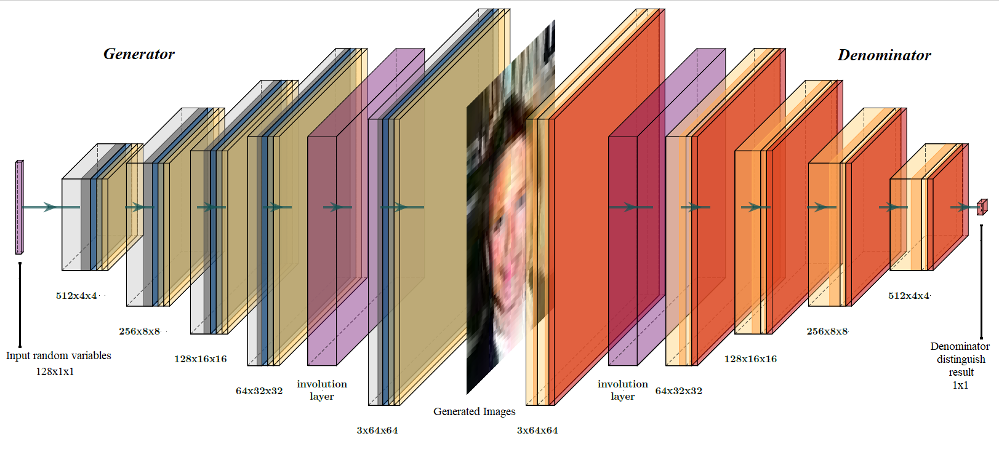
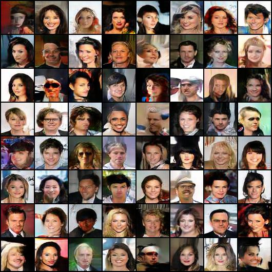
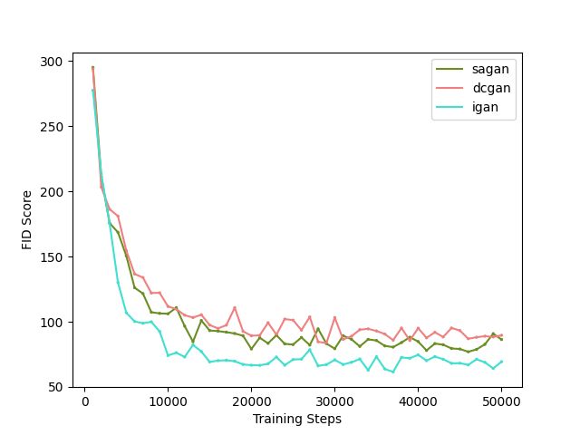
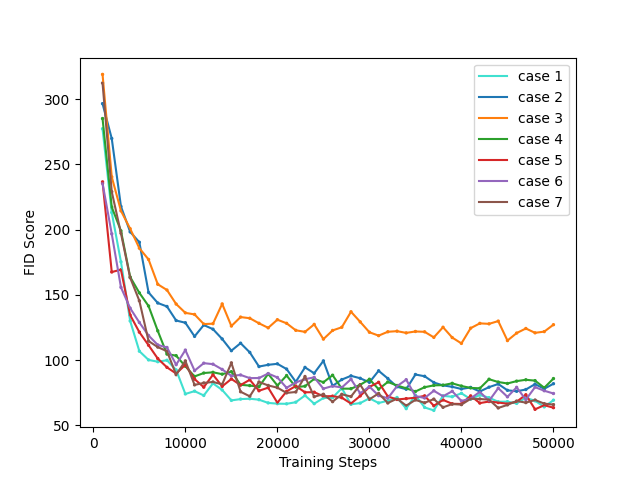

# InvolutionGAN

Run the main.py and set parameters.py

* you can download
  - MNIST dataset: http://yann.lecun.com/exdb/mnist/
  - CelebA dataset: http://mmlab.ie.cuhk.edu.hk/projects/CelebA.html

## Acknowledgement

```
@InProceedings{Li_2021_CVPR,
    author = {Li, Duo and Hu, Jie and Wang, Changhu and Li, Xiangtai and She, Qi and Zhu, Lei and Zhang, Tong and Chen, Qifeng},
    title = {Involution: Inverting the Inherence of Convolution for Visual Recognition},
    booktitle = {IEEE/CVF Conference on Computer Vision and Pattern Recognition (CVPR)},
    month = {June},
    year = {2021}
}
```

We thanks to the code from 
  - https://github.com/heykeetae/Self-Attention-GAN
  - https://github.com/ChristophReich1996/Involution
  - https://github.com/mseitzer/pytorch-fid

## Network Structure



## Sample

imgaes of iGAN have more saturated and smoother color over SAGAN and DCGAN



## Experiment Result

To distinguish the performance of iGAN, DCGAN, and SAGAN, we ensure the other parts of
networks consistent as much as possible. The simplest DCGAN is the basic structure, and SAGAN
adds an additional self-attention layer in both generator and discriminator. Likewise, iGAN adds an
additional involution at the same location. 



Hyperparameter tuning: different cases with respect to involution kernel size, group of involution, and reduction ratio.



## Report 
paper_33.pdf

## Slides
slides_33.pdf


